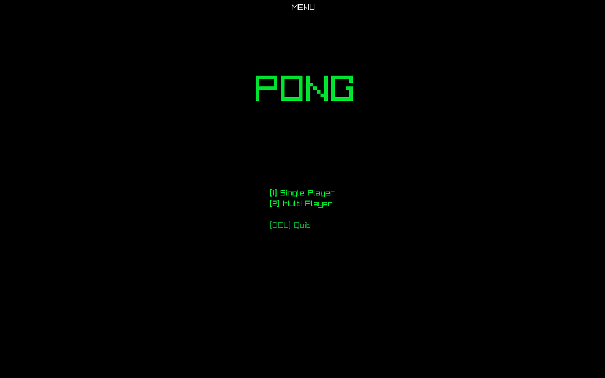
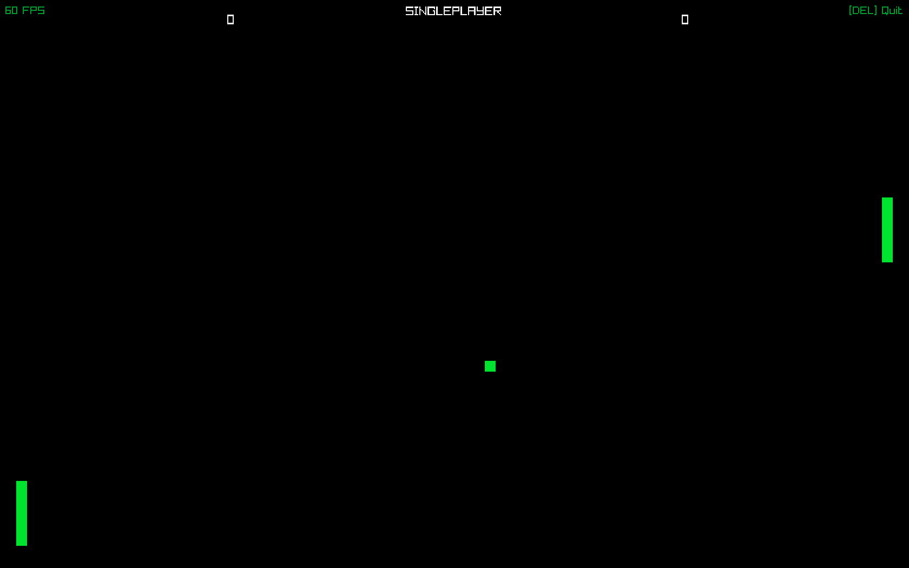
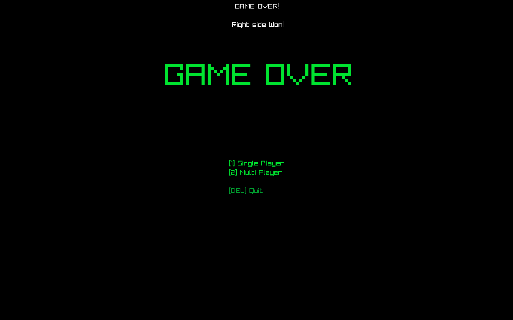

# Pong
Pong, clasic 2D game made with C++ and Raylib

## Screenshots
> You can find screenshots in img

## Others
* Max Score is 3
* Left Side Movement `W` & `S`
* Right Side Movement `Arrow Key Up` & `Arrow Key Down`
* `Escape` Return To Main Menu
* `Delete` Quit Game