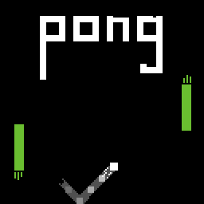
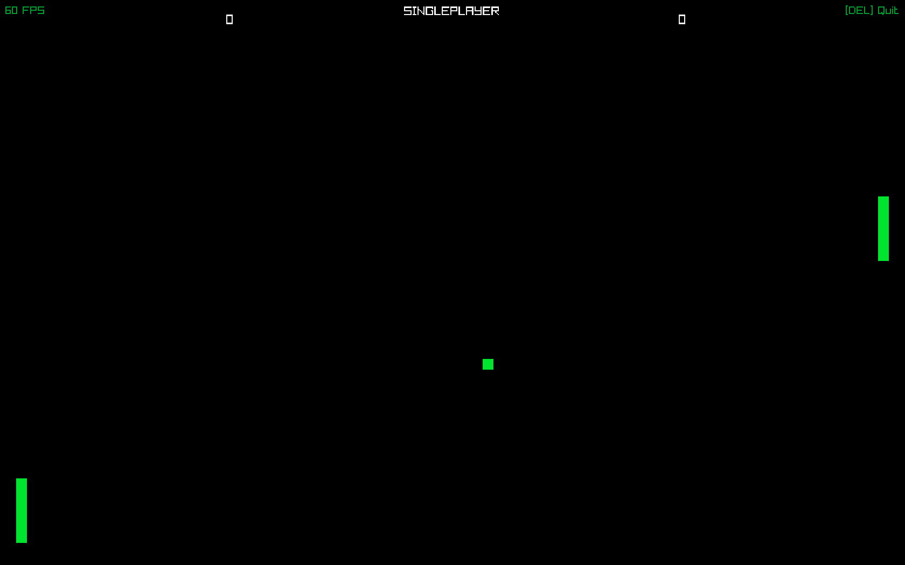

# Pong
Pong, clasic 2D game made with C++ and Raylib



> Assuming you already have Raylib installed on your device (You can see this [Link](https://github.com/raysan5/raylib/wiki/Working-on-GNU-Linux) for instructions)

## Play

### From releases
Install latest release executable, make sure you have Raylib installed and run the game

### Build Pong

1. Clone and cd into the project
    ```shell
    git clone -b linux-branch https://github.com/FinnTheHero/Pong.git && cd Pong
    ```

2. Make `build_prod.sh` executable and run it
    ```shell
    chmod +x build_prod.sh && ./build_prod.sh
    ```
This will generate executable in root directory of Pong `/`

## Work on Pong
1. Clone and cd into the project
    ```shell
    git clone -b linux-branch https://github.com/FinnTheHero/Pong.git && cd Pong
    ```

2. Make `build_dev.sh` executable and run it
    ```shell
    chmod +x build_dev.sh && ./build_dev.sh
    ```

## About Game
* Max Score is 3
* Left Side Movement `W` & `S`
* Right Side Movement `Arrow Key Up` & `Arrow Key Down`
* `Escape` Return To Main Menu
* `Delete` Quit Game

## Screenshots
> You can find screenshots in `/public/extras`



